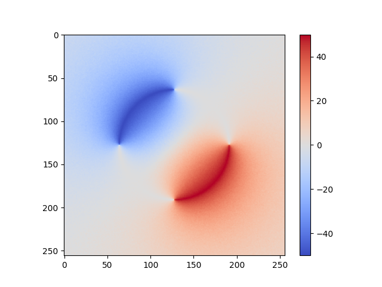

# Walk-on-Spheres (WoS)

<figure>
    <p align="center">
        
        <br><em>Credit: <a href="https://www.cs.cmu.edu/~kmcrane/">Keenan Crane - CMU School of Computer Science</a></em>
    </p>
</figure>


This is a [Taichi Lang](https://www.taichi-lang.org) implementation of the Walk-on-Spheres (WoS) algorithm and its variants for solving PDEs without discretizing the problem domain using Monte-Carlo estimators.
This project aims to implement recent methods proposed to solve various PDEs arising in geometry processing.

# Get Started

Clone the repository and setup a Python environment with the required dependencies:
```
git clone https://github.com/DveloperY0115/wos.git
cd wos
conda env create -f environment_{linux|macos}.yml
conda activate wos
export PYTHONPATH=.
```

Check the installation by running a simple example that solves the Laplace equation over a 2-sphere with a Dirichlet boundary condition::
```
python scripts/heat_sphere.py
```
The code should display the following image:
<figure>
    
</figure>

# Readings
This project is greatly inspired by the following papers:
- [Monte Carlo Geometry Processing: A Grid-Free Approach to PDE-Based Methods on Volumetric Domains, ACM ToG 2020](https://dl.acm.org/doi/abs/10.1145/3386569.3392374)
- [Grid-Free Monte Carlo for PDEs with Spatially Varying Coefficients, ACM ToG 2022](https://dl.acm.org/doi/abs/10.1145/3528223.3530134)
- [Boundary Value Caching for Walk on Spheres, ACM ToG 2023](https://dl.acm.org/doi/abs/10.1145/3592400)
- [Walk on Stars: A Grid-Free Monte Carlo Method for PDEs with Neumann Boundary Conditions, ACM ToG 2023](https://dl.acm.org/doi/abs/10.1145/3592398)
- [Walkin’ Robin: Walk on Stars with Robin Boundary Conditions, ACM ToG 2024](http://www.rohansawhney.io/WoStRobin.pdf)
