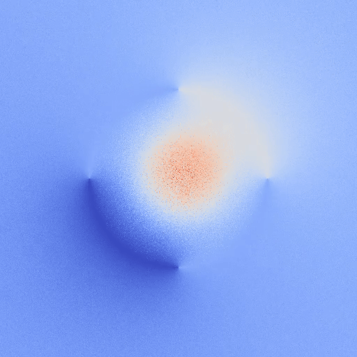

# Walk-on-Spheres (WoS)

<figure>
    <p align="center">
        
        <br><em>Credit: <a href="https://www.cs.cmu.edu/~kmcrane/">Keenan Crane - CMU School of Computer Science</a></em>
    </p>
</figure>


This is a [Taichi Lang](https://www.taichi-lang.org) implementation of the Walk-on-Spheres (WoS) algorithm and its variants for solving PDEs without discretizing the problem domain using Monte-Carlo estimators.
This project aims to implement recent methods proposed to solve various PDEs arising in geometry processing.

# Get Started

Clone the repository and setup a Python environment with the required dependencies:
```
git clone https://github.com/DveloperY0115/wos.git
cd wos
conda env create -f environment_{linux|macos}.yml
conda activate wos
export PYTHONPATH=.
```

Check the installation by running simple examples that solve the Laplace equation over a 2-sphere or a triangular mesh with a Dirichlet boundary condition:
```
python scripts/heat_sphere.py --out-dir {OUTPUT DIRECTORY} --{no-src-only|src-only}
python scripts/heat_mesh.py --mesh-path data/spot_unit_cube.obj --out-dir {OUTPUT DIRECTORY}
```
In the first script, setting the flag `--no-src-only` will solve the PDE with only boundary conditions, while `--src-only` will solve the PDE with only source terms.  

When executed, the codes should display the following visualizations: the first panel shows the solution with a boundary condition defined over a 2-sphere, while the second panel shows the solution with only source terms defined inside the 2-sphere. The third panel shows the solution with a boundary condition defined over a triangular mesh.
<table>
    <tr>
        <td>
            <figure>
                
            </figure>
        </td>
        <td>
            <figure>
                
            </figure>
        </td>
        <td>
            <figure>
                
            </figure>
        </td>
    </tr>
</table>

# TODOs
- [ ] Fix numerically unstable math functions (e.g., NaNs in Harmonic Green Functions and Yukawa Potentials, etc)
- [ ] Fix bugs in the Bounding Volume Hierarchy (BVH) on GPUs when certain meshes are used (e.g., CUDA, Metal, etc)
- [ ] Design a data structure for triangular meshes encapsulating:
    - Geometry with acceleration structures (e.g., BVH)
    - Boundary conditions
    - (Optional) Textures and materials for visualization

# Readings
This project is greatly inspired by the following papers:
- [Monte Carlo Geometry Processing: A Grid-Free Approach to PDE-Based Methods on Volumetric Domains, ACM ToG 2020](https://dl.acm.org/doi/abs/10.1145/3386569.3392374)
- [Grid-Free Monte Carlo for PDEs with Spatially Varying Coefficients, ACM ToG 2022](https://dl.acm.org/doi/abs/10.1145/3528223.3530134)
- [Boundary Value Caching for Walk on Spheres, ACM ToG 2023](https://dl.acm.org/doi/abs/10.1145/3592400)
- [Walk on Stars: A Grid-Free Monte Carlo Method for PDEs with Neumann Boundary Conditions, ACM ToG 2023](https://dl.acm.org/doi/abs/10.1145/3592398)
- [Walkin’ Robin: Walk on Stars with Robin Boundary Conditions, ACM ToG 2024](http://www.rohansawhney.io/WoStRobin.pdf)
